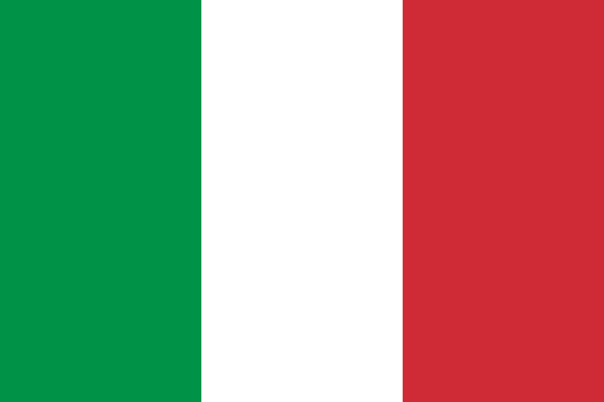

# [[Italy]] 

## International Names


[	name	 :: Italy ] 
[	name-en	 :: Italy ] 
[	name-es	 :: Italia ] 
[	name-fr	 :: Italie ] 
[	name-cn	 :: 意大利 ] 
[	name-ar	 :: إيطاليا ] 
[	name-ru	 :: Италия ] 

[ISO2::IT] 
[ISO3::ITA] 

#has_/url_for_/code_repository :: https://github.com/SpocWiki/Europe-Italy 

This Repository/Folder/Wiki/Vault contains freely usable Text and Data 
covering the European country of [Italy](https://en.wikipedia.org/wiki/Italy). 

This Repository is intended to be shared as a common basis, 
by including it as a Sub-Repository in local File-Systems, 
specifically as part of the [\_Standards](https://github.com/SpocWiki/_Standards) Repository. 

Check out this Repository into this Subfolder: 
\_Standards/geo/Continent/Europe/Europe~Central/Italy 

> Caution: this is a very deep folder Structure with up to 170 Characters! 
> Make sure to check it out into a shallow Location on Windows! 
> 
> If you see an opportunity to reduce this Depth, create an Issue and discuss first, 
> because Changes may break Links or at least require every User 
> to update their local Repos! 
> 
> Constraints to consider when refactoring: 
> - Every Folder Name should be unique, also the grouping-Folders, so you can link to it without specifying the relative Path 
> - all Link-Paths should be relative. Wiki-Links are possible, but only when the Target-Folders or Files have unique Names. 
> - Between each Level and its Sub-Levels there should be a grouping Folder, to allow adding other Lists. 
>   - e.g. a City's boroughs should NOT be directly in the City Folder, but in a Sub-Folder named `City~boroughs` 

### #has_/image_for_/flag 

#has_/image_for_/flag :: ![[./Flag_of_Italy.svg|200]]  

## #has_/text_of_/abstract  

>
> [Wikipedia](https://en.wikipedia.org/wiki/Italy)

## Maps and Flags 

### #has_/image_for_/coat_of_arms 

#has_/image_for_/coat_of_arms :: ![[./Emblem_of_Italy.svg|150]]  

#has_/sound_of_/anthem :: ![[Anthem-Italy.mp3]]

### #has_/map  

```leaflet
id: Italy
zoomFeatures: true 
minZoom: 2 
maxZoom: 18
geojsonFolder: .///
markerFolder: .//
```

[name-en::Italy] 
[name-de::Italien] 

[	ISO4217-currency_alphabetic	 :: EUR ] 
[	ISO4217-currency_name	 :: Euro ] 
[	ISO4217-currency_numeric	 :: 978 ] 
[	ISO4217-currency_minor_unit	 :: 2 ] 
[	ISO4217-currency_country_name	 :: ITALY ] 

[	Telephone	 :: 39 ] 

[	Global	 :: True ] 
[	Global_Name	 :: World ] 

[	CLDR_display_name	 :: Italy ] 

[	UNTERM_English	 :: Italy ] 
[	UNTERM_English_Formal	 :: the Republic of Italy ] 
[	UNTERM_Spanish_Formal	 :: la República Italiana ] 
[	UNTERM_Spanish	 :: Italia ] 
[	UNTERM_French	 :: Italie (l') [fém.] ] 
[	UNTERM_Arabic	 :: إيطاليا ] 
[	UNTERM_Arabic_Formal	 :: جمهورية إيطاليا ] 
[	UNTERM_Chinese	 :: 意大利 ] 
[	UNTERM_Chinese_Formal	 :: 意大利共和国 ] 
[	UNTERM_French_Formal	 :: la République italienne ] 
[	UNTERM_Russian	 :: Италия ] 
[	UNTERM_Russian_Formal	 :: Итальянская Республика ] 

Region_Name ::  [[Europe]] 
Intermediate_Region_Name ::  [[]] 
Sub-region_Name ::  [[Southern Europe]] 

[	Region	 :: 150 ] 
[	Intermediate_Region	 ::  ] 
[	Sub-region	 :: 39 ] 

[	Geoname-ID	 :: 3175395 ] 
[	FIPS	 :: IT ] 
[	FIFA	 :: ITA ] 
[	IOC	 :: ITA ] 
[	MARC	 :: it ] 
[	GAUL	 :: 122 ] 
[	WMO	 :: IY ] 
[	ITU	 :: I ] 
[	DS	 :: I ] 
[	TLD	 :: .it ] 
[	EDGAR	 :: L6 ] 
[	M49	 :: 380 ] 

[	is_independent	 :: Yes ] 
[	Developed_/Developing_Countries	 :: Developed ] 
[	Land_Locked_Developing_Countries	 ::  ] 
[	Least_Developed_Countries	 ::  ] 
[	Small_Island_Developing_States	 ::  ] 

[	ISO3166-1-numeric	 :: 380 ] 


[Area-Total::301302] 
[Area-Land::294060] 
Continent :: [[Europe]]  
[VehicleCode::I] 
Capital :: [[Italy/Counties/Lazio/Roma/City/Roma]]  

[Alcohol-l::10.7] 
[Language-Id::] 
[geo-lon::11.8169] 
[geo-lat::43.4809] 


## Confidential Links & Embeds: 
- [[../../../../../_Standards/geo/Continent/Europe/Europe~South/Italy|Italy]] 
- [[../../../../../_Standards/geo/Continent/Europe/Europe~South/Italy|Italy]] 
- [[../../../../../_public/geo/Continent/Europe/Europe~South/Italy.public|Italy.public]] 
- [[../../../../../_internal/geo/Continent/Europe/Europe~South/Italy.internal|Italy.internal]] 
- [[../../../../../_protect/geo/Continent/Europe/Europe~South/Italy.protect|Italy.protect]] 
- [[../../../../../_private/geo/Continent/Europe/Europe~South/Italy.private|Italy.private]] 
- [[../../../../../_personal/geo/Continent/Europe/Europe~South/Italy.personal|Italy.personal]] 
- [[../../../../../_secret/geo/Continent/Europe/Europe~South/Italy.secret|Italy.secret]] 

